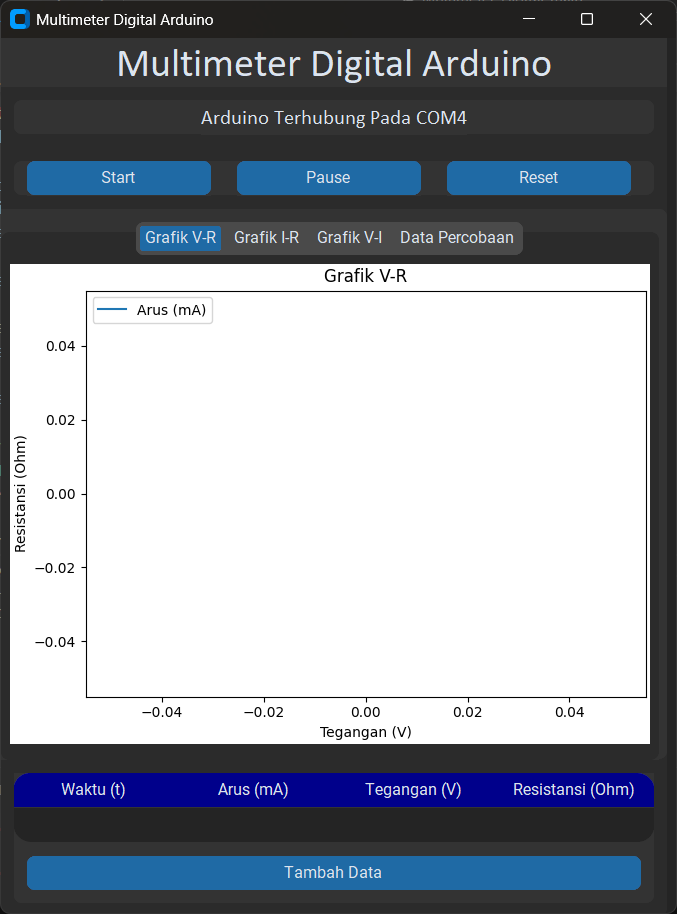
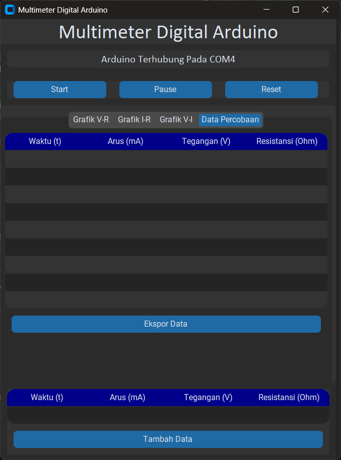

# Multimeter Digital with Python GUI

## Circuit Diagram

## Arduino Code

## Python Code

Install requirements file using command line
```bash
pip install -r requirements.txt
```

App View

<!--  -->



<!--  -->
